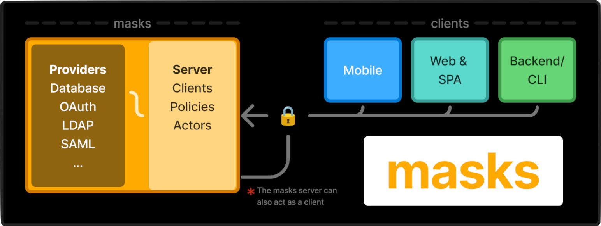

Masks is modern auth for Rails 8+ applications. <b>Masks is <b class="unstable">unstable. DO NOT USE IT.</b></b>

It is highly customizable, feature-rich, and aims to provide a complete,
open-source, end-to-end solution for securing Ruby on Rails apps. Although
masks is Ruby-based, it can be used to secure most apps, languages, and
frameworks. 💎

## Getting started

Run the masks server:

 - Using [pre-built container images](guides/docker)
 - Inside your Rails app, [as an engine](guides/rails)

Integrate your client(s) using the SDKs & APIs:

 - [Ruby](reference/ruby)
 - [Javascript](reference/js)
 - [GraphQL](reference/graphql)
 - [HTTP](reference/http)
 - [CLI](reference/cli)

Take a look at [the reference docs](reference/overview) for more information.

## Customization

The masks server is designed to _just work_, but it is easy to customize. You can:

 - [Configure masks](guides/configuration) using `masks.yml` or `Masks.configure`
 - Add [adapter configuration](guides/adapters) for live email, SMS, captcha, et al.
 - Override [built-in themes](guides/theme) with CSS, HTML, and layouts
 - Create your own [custom policy classes](guides/policies)
 - Use the API to [build custom frontends](guides/frontend)
 - [Migrate your app](guides/migration) from a legacy system

Check [the list of guides](guides/all) for more information on various use-cases.

## How it works

Under the hood, masks is built from a few core concepts:

 - Policies
 - Clients
 - Actors
 - and others...

To delegate authentication to a masks server you must create a _client_ for your
app. Clients dictate authentication behaviour for _actors_ in your system.  Your
client's _policies_ dictate what's expected for successful authentication, like
whether or not 2FA must be present, rate-limits, and more.

